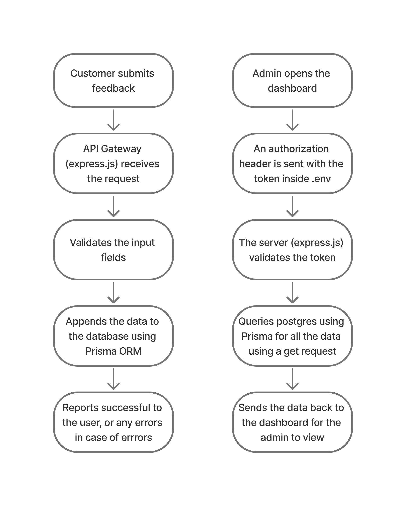

# Feedback Collection Form along with Admin Dashboard

## API Documentation

### Feedback Collection API

**Endpoint:** `/feedback`  
**Method:** `POST`  
**Content-Type:** `application/json`

#### Request Body

Send a JSON object with the following fields:

| Field      | Type   | Required | Description                            |
| ---------- | ------ | -------- | -------------------------------------- |
| `name`     | string | Yes      | Full name of the user                  |
| `email`    | string | Yes      | User's email address                   |
| `phone`    | string | Yes      | User's phone number                    |
| `rating`   | number | Yes      | Rating given by the user (e.g., 0.5–5) |
| `feedback` | string | No       | Textual feedback or comments           |

#### Example Request

```json
POST /feedback HTTP/1.1
Content-Type: application/json

{
  "name": "Husain Khorakiwala",
  "email": "husain@example.com",
  "phone": "9876543210",
  "rating": 4.5,
  "feedback": "Great experience, everything worked smoothly!"
}
```

#### Response

**Success (200 OK)**

```json
{
  "message": "Feedback submitted successfully"
}
```

**Error (400 Bad Request)**

```json
{
  "error": "Missing required fields"
}
```

**Error (500 Internal Server Error)**

```json
{
  "error": "Internal server error"
}
```

### Protected Route - GET Request

**Endpoint:** `/`  
**Method:** `GET`

#### Authorization

This route is protected and requires the **Authorization** header with a valid token. The header should be in the following format:

```
Authorization: <your_token_here>
```

#### Request Headers

| Header          | Type   | Required | Description                                   |
| --------------- | ------ | -------- | --------------------------------------------- |
| `Authorization` | string | Yes      | The token used for authenticating the request |

#### Example Request

```bash
GET /
Authorization: <your_token_here>
```

#### Response

**Success (200 OK)**

- It returns a list of all feedbacks

```json
[
  {
    "id": "16ff4b40-5dae-456e-be0f-4b1637d39251",
    "name": "Husain",
    "email": "test@gmail.com",
    "phone": "9876543210",
    "rating": 4,
    "feedback": "",
    "timestamp": "2025-04-22T05:40:19.724Z"
  }
]
```

**Error (401 Unauthorized)**

```json
{
  "error": "Unauthorized"
}
```

**Error (400 Bad Request)**

```json
{
  "error": "Invalid Authorization header format"
}
```

**Error (500 Internal Server Error)**

```json
{
  "error": "Internal server error"
}
```

## Database Schema: Feedback (Postgres)

| Field       | Type     | Attributes             | Description                                       |
| ----------- | -------- | ---------------------- | ------------------------------------------------- |
| `id`        | String   | `@id @default(uuid())` | Unique identifier (UUID)                          |
| `name`      | String   | –                      | Full name of the user                             |
| `email`     | String   | –                      | User's email address                              |
| `phone`     | String   | –                      | User's phone number                               |
| `rating`    | Float    | –                      | Rating given by the user (e.g., 1–5)              |
| `feedback`  | String   | –                      | User's feedback or comments                       |
| `timestamp` | DateTime | `@default(now())`      | Automatically set to the current time on creation |

## Data Flow & Project Architecture



### Project structure

```
project-root/
├── frontend/ # Next.js application
│ ├── public/ # Static assets
│ ├── components/ # React components
│ └── ... # Config files, styles, etc.
│
├── backend/ # Express.js + TypeScript backend
│ ├── src/
│ │ ├── config/ # DB config, env setup
│ │ ├── middlewares/ # Express middlewares (e.g. auth)
│ │ ├── routes/ # Route handlers
│ │ └── index.ts # Express entry point
│ │
│ ├── prisma/ # Prisma setup
│ │ ├── schema.prisma # Main DB schema
│ │ ├── migrations/ # DB migration history
│ │ └── generated/ # Prisma client
│ │
│ └── package.json # Backend dependencies
│
├── .gitignore
└── README.md
```

## Challenges faced and Solutions implemented

### 1. CORS Errors During Development

- Problem: The frontend couldn’t access the backend API due to missing CORS headers.
- Solution: Added CORS middleware in Express:

